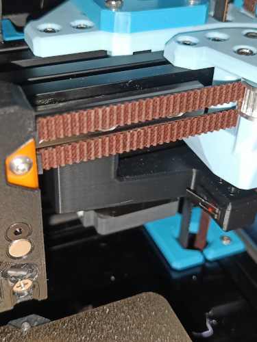
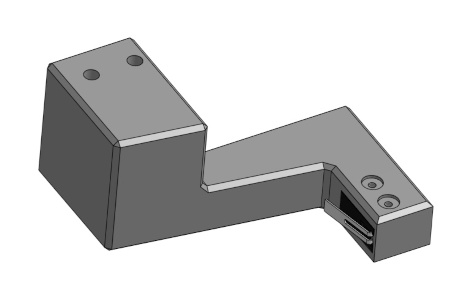

## A drive mounted X endstop

 

This endstop arm fits Micron R1 and mounts the X endstop rigidly to the gantry, wiring it via the Z chain together, so that the shuttle may remain without wiring, without having to wire it in series with the maxwell coupling and having to deal with multiple pins.

An internal cable channel and a zip tie mount on the back are provided to prevent any tangles.

Print as oriented and replace the two screws holding the bottom of the A drive to the back extrusion with M3x20 BHCS.
