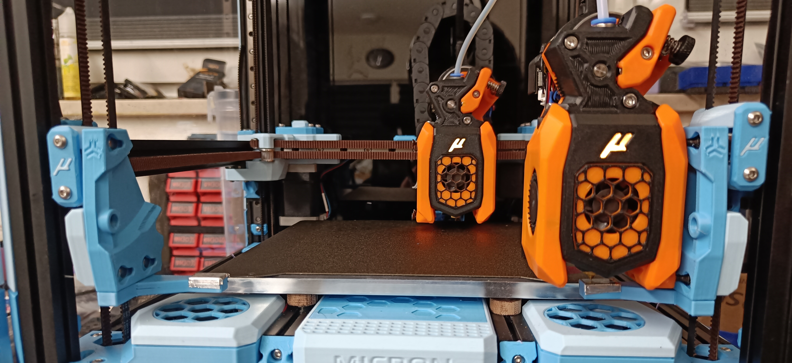

# Modified r2pdx docks

As the name suggests, these are a small edit of [Joseph Greiner's gantry docks](../../../joseph_greiner/micron/).

### !! These docks require at least 3mm door panel clearance

To recover a little of the lost print area - about 7mm, I've moved the docks toward the front, and shortened the keyhole geometry slightly. This may reduce reliabity, but I've completed a 100-toolchange soak test successfully.

Additionally, there are all-new nozzle stops designed for aluminium tape. These are not thoroughly tested yet!
